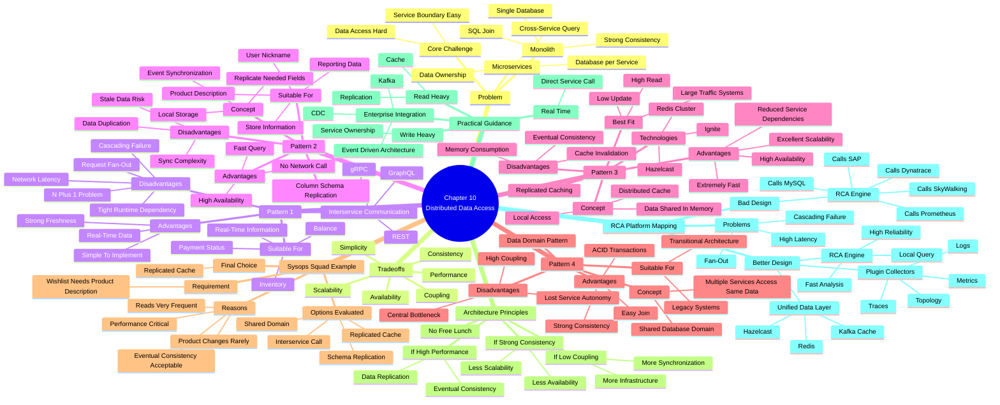

# Distributed Data Access

             Distributed Data Access
                           │
        ┌──────────────────┼──────────────────┐
        │                  │                  │
   Strong Consistency   High Performance   Low Coupling
        │                  │                  │
        ▼                  ▼                  ▼
 Interservice Call   Replicated Cache    Event Driven
 Shared Domain       Schema Replica      Data Sync
        │                  │                  │
   Fresh Data         Eventually         More Infra
                      Consistent
