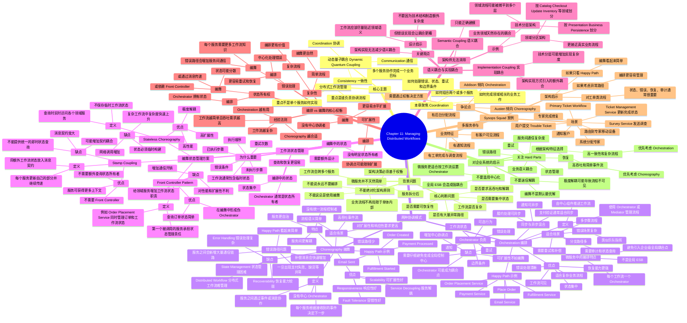

# Chapter 11: Managing Distributed Workflows 思维导图

```mermaid
mindmap
  root((Chapter 11: Managing Distributed Workflows))
    核心主题
      分布式工作流管理
        多个服务协作完成一个业务目标
        重点不是单个服务如何实现
        重点是谁负责协调流程
      动态量子耦合 Dynamic Quantum Coupling
        Communication 通信
        Consistency 一致性
        Coordination 协调
      本章聚焦 Coordination
        如何组合两个或多个服务
        如何完成领域相关的业务工作
        如何处理错误、状态、重试和边界条件

    背景问题
      微服务并不天然简单
        服务拆分后
        工作流会跨多个服务
        业务流程不再局限于单体内部
      不能绝对化架构原则
        不能说总是使用编舞
        不能说永远不要编排
        架构决策必须基于权衡
      核心判断问题
        工作流是否复杂
        是否有大量异常路径
        是否需要集中状态
        是否需要可恢复性
        是否要求高吞吐和解耦

    两种协调模式
      Orchestration 编排
        定义
          使用 Orchestrator 或 Mediator 管理流程
          类似乐队指挥
          由中心组件推进工作流
        Orchestrator 负责
          工作流状态
          可选行为
          错误处理
          通知
          重试
          边界条件
        微服务中的编排特点
          每个工作流一个 Orchestrator
          不是全局 ESB
          避免引入企业级全局耦合点
        Happy Path 示例
          Place Order
          Order Placement Service
          Payment Service
          Fulfillment Service
          Email Service
        同步与异步混合
          支付验证通常适合同步
          履约处理可异步
          通知可异步
        优点
          工作流可见
          状态集中
          错误处理清晰
          恢复能力更强
          适合复杂业务流程
        缺点
          增加中心协调点
          可扩展性不如编舞
          Orchestrator 可能成为耦合点
          需要仔细避免变成全局控制中心
        适合场景
          多步骤流程
          分支路径多
          错误场景复杂
          需要审计和状态查询
          需要重试和补偿

      Choreography 编舞
        定义
          没有中心 Orchestrator
          服务之间通过事件或消息协作
          每个服务根据接收到的事件决定下一步
        特点
          服务更自治
          服务间更解耦
          没有统一流程控制者
        Happy Path 示例
          Order Created
          Payment Processed
          Fulfillment Started
          Email Sent
        优点
          Responsiveness 响应性好
          Scalability 可扩展性好
          Fault Tolerance 容错性好
          Service Decoupling 服务解耦
        缺点
          Distributed Workflow 分布式工作流难管理
          State Management 状态管理困难
          Error Handling 错误处理复杂
          Recoverability 恢复能力较弱
        错误路径问题
          Happy Path 看起来简单
          一旦出现支付失败、缺货等异常
          服务之间会新增大量通信链路
          补偿消息会快速增加
        适合场景
          高吞吐事件流
          错误路径少
          流程语义简单
          对扩展性和响应性要求更高

    工作流状态管理
      为什么重要
        工作流通常包含临时状态
        已执行步骤
        未执行步骤
        执行顺序
        错误条件
        重试次数
      编排中的状态
        Orchestrator 通常是状态所有者
        状态集中
        查询和恢复更容易
      编舞中的状态
        没有明显状态所有者
        需要额外设计

      编舞状态管理方案
        Front Controller Pattern
          定义
            第一个被调用的服务承担状态管理责任
            例如 Order Placement Service 同时管理订单和工作流状态
          优点
            在编舞中形成伪 Orchestrator
            查询订单状态简单
          缺点
            给领域服务增加工作流状态职责
            增加通信开销
            对性能和扩展性不利

        Stateless Choreography
          定义
            不保存临时工作流状态
            查询时实时访问各个领域服务
          优点
            高性能
            高扩展性
            极度解耦
          缺点
            状态必须临时构建
            网络调用增加
            复杂工作流中复杂度快速上升

        Stamp Coupling
          定义
            将额外工作流状态放入消息契约
            每个服务更新自己的部分并继续传递
          优点
            不需要额外查询状态所有者
            不需要 Front Controller
            服务可获得更多上下文
          缺点
            消息契约变大
            不能提供统一的即时状态查询
            可能增加契约耦合

    语义耦合与实现耦合
      Semantic Coupling 语义耦合
        业务领域天然存在的耦合
        架构师无法消除
        只能正确建模
      Implementation Coupling 实现耦合
        架构实现方式引入的额外耦合
        技术分层可能增加实现复杂度
      关键观点
        架构实现无法减少语义耦合
        但错误实现会让耦合更糟
      示例
        技术分层架构
          按 Presentation Business Persistence 划分
          领域流程可能被摊平到多个层
        领域分区架构
          按 Catalog Checkout Update Inventory 等领域划分
          更接近真实业务流程
      设计启示
        工作流应该尽量贴近领域语义
        不要因为技术结构制造额外复杂度

    编排 vs 编舞的核心权衡
      状态所有权
        编排
          Orchestrator 拥有状态
        编舞
          状态可能分散
          或依赖 Front Controller
          或通过消息传递
      错误处理
        编排
          中心化处理错误
          更容易重试和恢复
        编舞
          每个服务需要更多工作流知识
          错误路径会增加服务间通信
      可扩展性
        编排
          协调点可能限制扩展
        编舞
          没有中心协调者
          更容易水平扩展
      复杂性
        简单流程
          编舞更自然
        复杂流程
          编排更有价值
      经验法则
        工作流越复杂
        Orchestration 越有用
        工作流越简单且吞吐需求越高
        Choreography 越合适

    Sysops Squad 案例
      场景
        Primary Ticket Workflow
        用户提交 Trouble Ticket
        系统分配专家
        路由到专家移动设备
        通知客户
        专家完成修复
        Ticket Management Service 更新完成状态
        Survey Service 发送调查
      争论点
        Addison 倾向 Orchestration
        Austen 倾向 Choreography
        需要通过权衡决定方案
      业务特征
        多服务参与
        有客户可见流程
        有后台分配流程
        有通知流程
        有工单完成与调查流程
      架构启示
        如果只看 Happy Path
          编舞看起来简单
        如果考虑异常路径
          编排更容易管理
        对工单类流程
          状态、错误、恢复、审计通常很重要

    对企业系统的启示
      不要迷信解耦
        极度解耦可能导致流程不可见
        编舞不是默认最优解
      不要滥用中心化
        全局 ESB 会造成强耦合
        微服务更适合按工作流设置 Orchestrator
      根据架构特征选择
        高一致性和复杂流程
          优先考虑 Orchestration
        高吞吐和简单事件流
          优先考虑 Choreography
      关注 Hard Parts
        错误路径
        状态管理
        重试
        恢复
        业务语义耦合
        服务间通信复杂度

```    