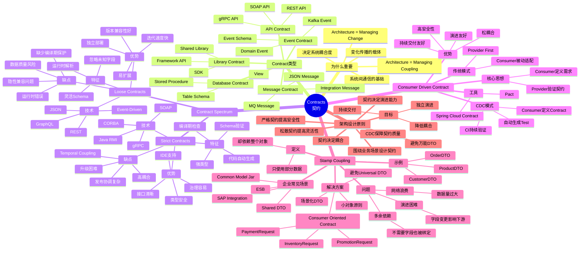

# Chapter 13 - Contracts（契约）

```mermaid
mindmap
  root((Contracts<br>契约))

    为什么重要
      系统间通信的基础
      变化传播的载体
      决定系统耦合度
      Architecture = Managing Change
      Architecture = Managing Coupling

    Contract类型

      API Contract
        REST API
        gRPC API
        SOAP API

      Event Contract
        Kafka Event
        Domain Event
        Event Schema

      Message Contract
        JSON Message
        MQ Message
        Integration Message

      Database Contract
        Table Schema
        View
        Stored Procedure

      Library Contract
        SDK
        Shared Library
        Framework API

    Contract Spectrum

      Strict Contracts

        特征
          强类型
          Schema验证
          编译期检查
          代码自动生成

        技术
          SOAP
          gRPC
          CORBA
          Java RMI

        优势
          类型安全
          IDE支持
          治理容易
          接口清晰

        缺点
          高耦合
          升级困难
          发布协调复杂
          Temporal Coupling

      Loose Contracts

        特征
          灵活Schema
          忽略未知字段
          运行时解析

        技术
          REST
          JSON
          GraphQL
          Event-Driven

        优势
          独立部署
          版本兼容性好
          迭代速度快
          易扩展

        缺点
          缺少编译期保护
          运行时错误
          数据质量风险
          隐性兼容问题

    Consumer Driven Contract

      核心思想
        Consumer定义需求
        Provider验证契约

      传统模式
        Provider First
        Consumer被动适配

      CDC模式
        Consumer定义Contract
        自动生成Test
        CI持续验证

      工具
        Pact
        Spring Cloud Contract

      优势
        松耦合
        高安全性
        演进友好
        持续交付友好

    Stamp Coupling

      定义
        只使用部分数据
        却依赖整个对象

      示例
        CustomerDTO
        OrderDTO
        ProductDTO

      问题

        网络浪费
          数据量过大

        多余依赖
          不需要字段也被绑定

        演进困难
          字段变更影响下游

      企业常见场景
        SAP Integration
        ESB
        Shared DTO
        Common Model Jar

      解决方案

        Consumer Oriented Contract
          PromotionRequest
          InventoryRequest
          PaymentRequest

        小对象原则
        场景化DTO
        避免Universal DTO

    架构设计原则

      契约决定耦合
      契约决定演进能力
      严格契约提高安全性
      松散契约提高灵活性
      CDC保障契约质量
      避免万能DTO
      围绕业务场景设计契约

  

      目标
        独立演进
        降低耦合
        持续交付
```
