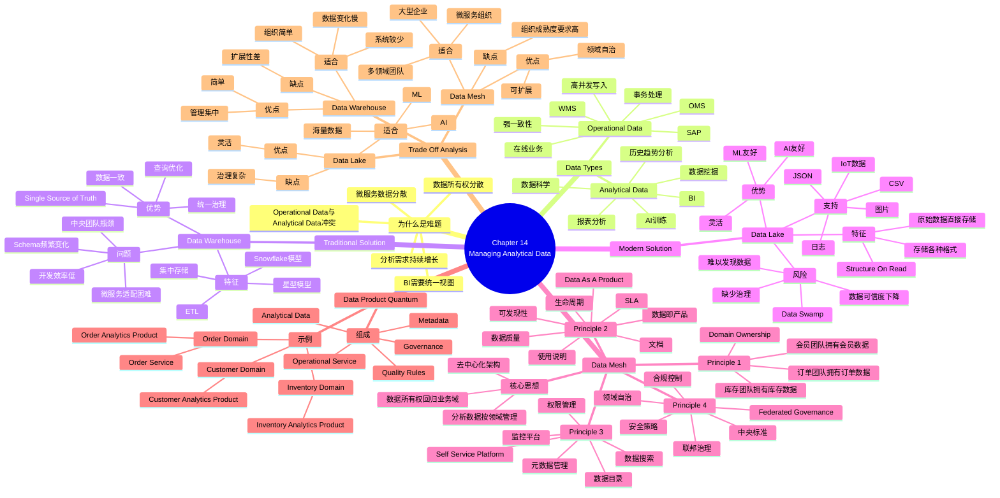

```mermaid
mindmap
  root((Chapter 14<br>Managing Analytical Data))

    为什么是难题
      微服务数据分散
      数据所有权分散
      BI需要统一视图
      分析需求持续增长
      Operational Data与Analytical Data冲突

    Data Types

      Operational Data
        事务处理
        高并发写入
        强一致性
        在线业务
        SAP
        OMS
        WMS

      Analytical Data
        报表分析
        BI
        数据科学
        AI训练
        数据挖掘
        历史趋势分析

    Traditional Solution

      Data Warehouse

        特征
          ETL
          集中存储
          星型模型
          Snowflake模型

        优势
          Single Source of Truth
          统一治理
          查询优化
          数据一致

        问题
          中央团队瓶颈
          Schema频繁变化
          微服务适配困难
          开发效率低

    Modern Solution

      Data Lake

        特征
          原始数据直接存储
          Structure On Read
          存储各种格式

        支持
          CSV
          JSON
          图片
          日志
          IoT数据

        优势
          灵活
          AI友好
          ML友好

        风险
          Data Swamp
          缺少治理
          难以发现数据
          数据可信度下降

    Data Mesh

      核心思想
        分析数据按领域管理
        数据所有权回归业务域
        去中心化架构

      Principle 1
        Domain Ownership

        订单团队拥有订单数据
        库存团队拥有库存数据
        会员团队拥有会员数据

      Principle 2
        Data As A Product

        数据即产品

        文档
        SLA
        生命周期
        可发现性
        数据质量
        使用说明

      Principle 3
        Self Service Platform

        数据目录
        权限管理
        元数据管理
        数据搜索
        监控平台

      Principle 4
        Federated Governance

        联邦治理

        中央标准
        领域自治
        合规控制
        安全策略

    Data Product Quantum

      组成

        Operational Service

        Analytical Data

        Metadata

        Governance

        Quality Rules

      示例

        Order Domain
          Order Service
          Order Analytics Product

        Inventory Domain
          Inventory Analytics Product

        Customer Domain
          Customer Analytics Product

    Trade Off Analysis

      Data Warehouse

        适合
          系统较少
          组织简单
          数据变化慢

        优点
          简单
          管理集中

        缺点
          扩展性差

      Data Lake

        适合
          AI
          ML
          海量数据

        优点
          灵活

        缺点
          治理复杂

      Data Mesh

        适合
          微服务组织
          大型企业
          多领域团队

        优点
          可扩展
          领域自治

        缺点
          组织成熟度要求高
```
