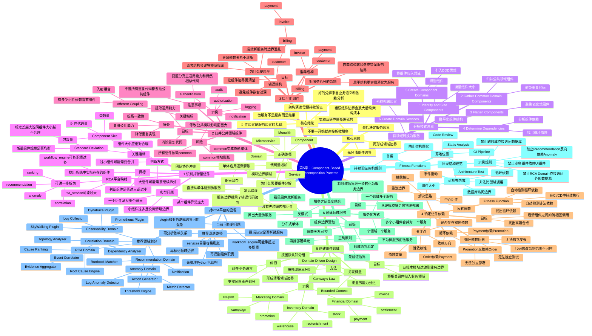

# Component-Based Decomposition Patterns

```mermaid
mindmap
  root((第5章：Component-Based Decomposition Patterns))
    核心思想
      先分清组件边界
      再形成领域边界
      最后决定服务边界
      不要一开始就直接拆微服务
      架构演进应是渐进式的
    为什么需要组件分解
      单体应用逐渐膨胀
        代码量增加
        职责混杂
        模块边界模糊
        团队协作冲突
      常见错误
        直接从单体跳到微服务
        没有先梳理内部组件
        服务边界继承了错误代码边界
      正确路径
        Monolith
        Component
        Domain
        Service
        Microservice
    分解模式总览
      1 Identify and Size Components
        识别组件
        衡量组件大小
      2 Gather Common Domain Components
        归并公共领域组件
        避免重复代码
      3 Flatten Components
        扁平化组件结构
        避免嵌套式组件
      4 Determine Dependencies
        分析组件依赖
        找出循环依赖
      5 Create Component Domains
        将组件归入领域
        引入DDD思想
      6 Create Domain Services
        将领域转换为服务
        形成部署边界
    1 识别并衡量组件
      目标
        找出系统中实际存在的组件
        判断组件是否过大或过小
      关键指标
        Component Size
          组件代码量
          类数量
          包数量
        Standard Deviation
          衡量组件规模是否均衡
          标准差越大说明组件大小越不合理
      典型问题
        某个组件异常庞大
        一个组件承担多个职责
        小组件过多且没有清晰边界
      判断方式
        大组件可能需要继续拆分
        过小组件可能需要合并
        组件大小应相对合理
      RCA平台映射
        rca_service可能过大
        workflow_engine可能职责过多
        可进一步拆为
          anomaly
          correlation
          ranking
          recommendation
    2 归并公共领域组件
      目标
        消除重复代码
        提取通用能力
      示例
        notification
        authentication
        authorization
        logging
        audit
      好处
        降低重复实现
        提高一致性
        复用公共能力
      风险
        common模块膨胀
        所有组件依赖common
        common变成隐形单体
        修改公共模块影响面巨大
      关键指标
        Afferent Coupling
          入射耦合
          有多少组件依赖当前组件
      注意事项
        不是所有重复代码都要抽公共组件
        要区分真正通用能力和偶然相似代码
    3 扁平化组件
      目标
        避免组件嵌套过深
        让组件边界更清楚
      错误结构
        customer
          billing
            invoice
              payment
      推荐结构
        customer
        billing
        invoice
        payment
      为什么要扁平
        嵌套结构会误导领域归属
        导致依赖关系不清晰
        后续拆服务时边界混乱
      对服务拆分的影响
        扁平结构更容易演化为服务
        嵌套结构容易造成错误服务边界
    4 确定组件依赖
      目标
        看清组件之间如何相互调用
        找出高耦合点
        找出循环依赖
      关注点
        依赖方向
        依赖数量
        谁依赖谁
        是否存在双向依赖
      循环依赖
        Order依赖Payment
        Payment依赖Promotion
        Promotion又依赖Order
      循环依赖后果
        无法独立测试
        无法独立发布
        无法独立部署
        代码修改影响范围不可控
      解决思路
        反转依赖
        抽象接口
        事件驱动
        中介组件
        重划边界
      Fitness Function
        自动检测循环依赖
        自动检测非法依赖
        在CI/CD中持续执行
    5 创建组件领域
      目标
        将相关组件归入业务领域
        从技术模块过渡到业务边界
      方法
        按业务能力分组
        按领域语义分组
        按团队认知分组
      示例
        Financial Domain
          payment
          invoice
          settlement
        Marketing Domain
          promotion
          coupon
          campaign
        Inventory Domain
          stock
          warehouse
          replenishment
      价值
        形成清晰领域边界
        支撑团队责任划分
        对齐业务语言
      关联概念
        Domain-Driven Design
        Bounded Context
        Conway's Law
    6 创建领域服务
      目标
        将领域边界进一步转化为服务边界
        从逻辑模块走向物理部署
      前提
        组件边界清楚
        领域边界稳定
        依赖关系可控
      服务化方式
        一个领域一个服务
        一个领域多个服务
        多个小组件合并为一个服务
      反模式
        看见组件就拆服务
        拆出大量微服务
        服务之间高度耦合
        分布式单体
      正确原则
        先验证边界
        再拆部署单元
        不为微服务而微服务
    Fitness Functions
      作用
        持续验证架构规则
        防止架构腐化
      可检查内容
        组件大小
        循环依赖
        非法跨领域调用
        目录结构规范
        数据库访问边界
      示例规则
        禁止RCA Domain直接访问外部数据源
        禁止Recommendation反向依赖Anomaly
        禁止业务组件依赖UI组件
        禁止跨领域直接访问数据库
      落地位置
        CI Pipeline
        Code Review
        Architecture Test
        Static Analysis
    对RCA平台的启发
      当前可能的问题
        services目录容易膨胀
        workflow_engine可能承担过多职责
        plugin和业务逻辑边界可能混杂
      推荐领域划分
        Observability Domain
          Prometheus Plugin
          SkyWalking Plugin
          Dynatrace Plugin
          Log Collector
        Anomaly Domain
          Metric Detector
          Log Anomaly Detector
          Threshold Engine
        Correlation Domain
          Dependency Analyzer
          Topology Analyzer
          Event Correlator
        RCA Domain
          Root Cause Engine
          Cause Ranking
          Evidence Aggregator
        Recommendation Domain
          Action Generator
          Runbook Matcher
          Notification
      推荐演进路径
        先整理Python包结构
        再识别组件职责
        再标记领域边界
        再分析依赖关系
        最后决定是否拆微服务
    核心结论
      组件边界是服务边界的基础
      错误组件边界会放大后续架构成本
      微服务不是起点而是结果
      好的分解来自业务语义和依赖分析
      架构演进需要持续验证
```