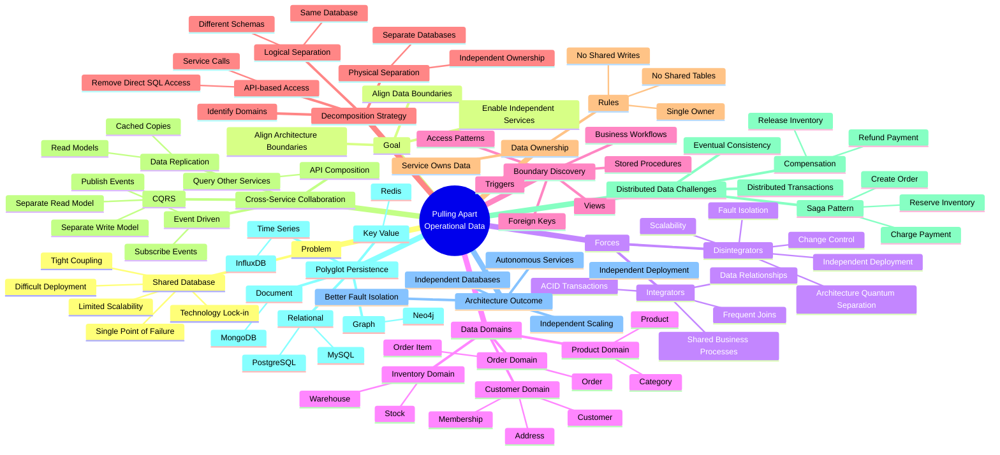

# Pulling Apart Operational Data

```mermaid
mindmap
  root((Pulling Apart<br>Operational Data))

    Problem
      Shared Database
        Tight Coupling
        Difficult Deployment
        Limited Scalability
        Single Point of Failure
        Technology Lock-in

    Goal
      Align Architecture Boundaries
      Align Data Boundaries
      Enable Independent Services

    Forces

      Disintegrators
        Change Control
        Independent Deployment
        Scalability
        Fault Isolation
        Architecture Quantum Separation

      Integrators
        ACID Transactions
        Frequent Joins
        Data Relationships
        Shared Business Processes

    Data Domains

      Customer Domain
        Customer
        Address
        Membership

      Order Domain
        Order
        Order Item

      Inventory Domain
        Stock
        Warehouse

      Product Domain
        Product
        Category

    Boundary Discovery

      Foreign Keys
      Triggers
      Stored Procedures
      Views
      Access Patterns
      Business Workflows

    Decomposition Strategy

      Identify Domains

      Logical Separation
        Different Schemas
        Same Database

      API-based Access
        Service Calls
        Remove Direct SQL Access

      Physical Separation
        Separate Databases
        Independent Ownership

    Data Ownership

      Service Owns Data

      Rules
        Single Owner
        No Shared Writes
        No Shared Tables

    Cross-Service Collaboration

      API Composition
        Query Other Services

      Event Driven
        Publish Events
        Subscribe Events

      Data Replication
        Cached Copies
        Read Models

      CQRS
        Separate Read Model
        Separate Write Model

    Distributed Data Challenges

      Distributed Transactions

      Eventual Consistency

      Saga Pattern
        Reserve Inventory
        Create Order
        Charge Payment

      Compensation
        Release Inventory
        Refund Payment

    Polyglot Persistence

      Relational
        MySQL
        PostgreSQL

      Key Value
        Redis

      Document
        MongoDB

      Graph
        Neo4j

      Time Series
        InfluxDB

    Architecture Outcome

      Autonomous Services

      Independent Deployment

      Independent Scaling

      Independent Databases

      Better Fault Isolation
```
