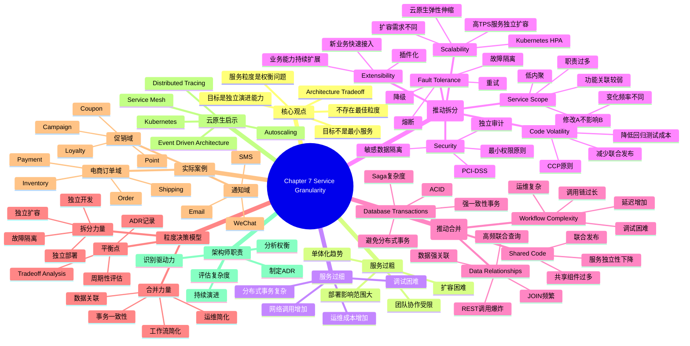

# Service Granularity

```mermaid
mindmap
  root((Chapter 7 Service Granularity))

    核心观点
      服务粒度是权衡问题
      不存在最佳粒度
      目标不是最小服务
      目标是独立演进能力
      Architecture Tradeoff

    服务过粗
      单体化趋势
      部署影响范围大
      扩容困难
      团队协作受限

    服务过细
      网络调用增加
      分布式事务复杂
      调试困难
      运维成本增加

    Disintegrators(推动拆分)

      Service Scope
        职责过多
        低内聚
        功能关联较弱
        修改A不影响B

      Code Volatility
        变化频率不同
        CCP原则
        减少联合发布
        降低回归测试成本

      Scalability
        扩容需求不同
        高TPS服务独立扩容
        云原生弹性伸缩
        Kubernetes HPA

      Fault Tolerance
        故障隔离
        降级
        熔断
        重试

      Security
        敏感数据隔离
        最小权限原则
        PCI-DSS
        独立审计

      Extensibility
        插件化
        新业务快速接入
        业务能力持续扩展

    Integrators(推动合并)

      Database Transactions
        强一致性事务
        ACID
        避免分布式事务
        Saga复杂度

      Workflow Complexity
        调用链过长
        延迟增加
        调试困难
        运维复杂

      Shared Code
        共享组件过多
        联合发布
        服务独立性下降

      Data Relationships
        数据强关联
        高频联合查询
        JOIN频繁
        REST调用爆炸

    粒度决策模型

      拆分力量
        独立开发
        独立部署
        独立扩容
        故障隔离

      合并力量
        事务一致性
        数据关联
        工作流简化
        运维简化

      平衡点
        Tradeoff Analysis
        ADR记录
        周期性评估

    实际案例

      电商订单域
        Order
        Payment
        Inventory
        Shipping

      促销域
        Campaign
        Coupon
        Loyalty
        Point

      通知域
        Email
        SMS
        WeChat

    云原生启示

      Kubernetes
      Service Mesh
      Distributed Tracing
      Autoscaling
      Event Driven Architecture

    架构师职责

      分析权衡
      识别驱动力
      评估复杂度
      制定ADR
      持续演进
```