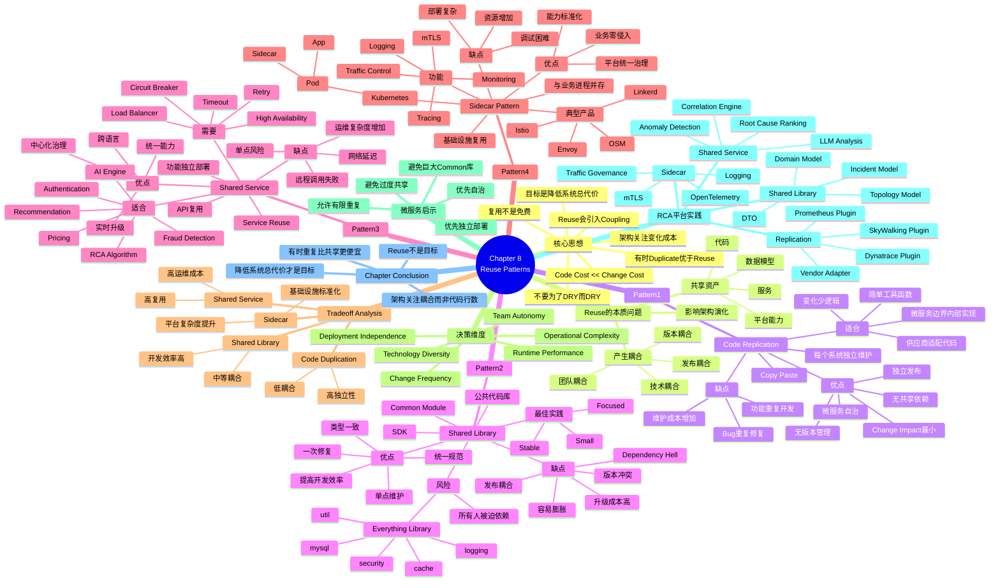

# Reuse Patterns

```mermaid
mindmap
  root((Chapter 8<br>Reuse Patterns))

    核心思想
      复用不是免费
      Reuse会引入Coupling
      架构关注变化成本
      不要为了DRY而DRY
      有时Duplicate优于Reuse
      Code Cost << Change Cost
      目标是降低系统总代价

    Reuse的本质问题
      共享资产
        代码
        数据模型
        服务
        平台能力
      产生耦合
        版本耦合
        发布耦合
        技术耦合
        团队耦合
      影响架构演化

    Pattern1
      Code Replication
        Copy Paste
        每个系统独立维护

        优点
          无共享依赖
          无版本管理
          独立发布
          Change Impact最小
          微服务自治

        缺点
          Bug重复修复
          功能重复开发
          维护成本增加

        适合
          变化少逻辑
          简单工具函数
          供应商适配代码
          微服务边界内部实现

    Pattern2
      Shared Library
        公共代码库
        SDK
        Common Module

        优点
          单点维护
          一次修复
          统一规范
          类型一致
          提高开发效率

        缺点
          版本冲突
          升级成本高
          发布耦合
          Dependency Hell
          容易膨胀

        风险
          Everything Library
            util
            cache
            mysql
            security
            logging
          所有人被迫依赖

        最佳实践
          Small
          Focused
          Stable

    Pattern3
      Shared Service
        功能独立部署
        API复用
        Service Reuse

        优点
          跨语言
          统一能力
          实时升级
          中心化治理

        缺点
          网络延迟
          远程调用失败
          单点风险
          运维复杂度增加

        需要
          Timeout
          Retry
          Circuit Breaker
          Load Balancer
          High Availability

        适合
          Authentication
          Recommendation
          Pricing
          Fraud Detection
          AI Engine
          RCA Algorithm

    Pattern4
      Sidecar Pattern
        基础设施复用
        与业务进程并存

        Kubernetes
          Pod
            App
            Sidecar

        功能
          Logging
          Monitoring
          Tracing
          mTLS
          Traffic Control

        典型产品
          Envoy
          Istio
          Linkerd
          OSM

        优点
          业务零侵入
          平台统一治理
          能力标准化

        缺点
          资源增加
          部署复杂
          调试困难

    Tradeoff Analysis
      Code Duplication
        低耦合
        高独立性

      Shared Library
        中等耦合
        开发效率高

      Shared Service
        高复用
        高运维成本

      Sidecar
        基础设施标准化
        平台复杂度提升

    决策维度
      Change Frequency
      Team Autonomy
      Runtime Performance
      Operational Complexity
      Deployment Independence
      Technology Diversity

    微服务启示
      优先自治
      优先独立部署
      允许有限重复
      避免过度共享
      避免巨大Common库

    RCA平台实践
      Shared Library
        Domain Model
        Incident Model
        Topology Model
        DTO

      Shared Service
        Correlation Engine
        Anomaly Detection
        Root Cause Ranking
        LLM Analysis

      Sidecar
        OpenTelemetry
        Logging
        mTLS
        Traffic Governance

      Replication
        Vendor Adapter
        Prometheus Plugin
        Dynatrace Plugin
        SkyWalking Plugin

    Chapter Conclusion
      Reuse不是目标
      降低系统总代价才是目标
      架构关注耦合而非代码行数
      有时重复比共享更便宜
```
