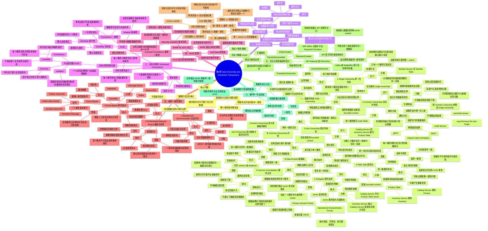

# Data Ownership and Distributed Transactions

```mermaid
mindmap
  root((第9章 Data Ownership and Distributed Transactions))
    核心问题
      数据拆分后如何重新组织
        哪个服务拥有哪张表
        服务如何访问不属于自己的数据
        跨服务业务如何保持一致性
      微服务真正的难点
        不是服务拆分
        而是数据边界与事务边界

    一、数据所有权 Data Ownership
      基本原则
        谁写表 谁拥有表
        读操作不决定所有权
        写操作决定数据责任边界
      目标
        服务和数据形成紧密 bounded context
        降低服务之间的数据耦合
        避免多个服务直接操作同一张表

      1 Single Ownership 单一所有权
        定义
          只有一个服务写某张表
        示例
          Wishlist Service 写 Wishlist Table
        处理方式
          该服务成为表的唯一 owner
          其他服务如需访问只能读或通过接口/消息
        优点
          最简单
          边界清晰
          服务自治性强
          易于维护和部署
        架构含义
          优先解决 single ownership
          为后续复杂场景清理边界

      2 Common Ownership 共同所有权
        定义
          大多数或所有服务都需要写同一张表
        示例
          多个服务都写 Audit Table
        问题
          很难判断谁拥有这张表
          共享数据库会重新引入数据共享问题
          容易产生变更控制问题
          容易出现连接耗尽
          可伸缩性和容错性下降
        推荐方案
          创建专门的数据服务
            Audit Service
          该服务成为唯一写入者
          其他服务通过消息或接口提交数据
        通信方式
          不需要返回结果
            persistent queue
            asynchronous fire-and-forget
          需要返回结果
            REST
            gRPC
            request-reply messaging
        关键收益
          把 common ownership 转换成 single ownership
          保留服务边界
          减少共享数据库风险

      3 Joint Ownership 联合所有权
        定义
          少数几个服务在同一领域内写同一张表
        示例
          Catalog Service 和 Inventory Service 都写 Product Table
        与 Common Ownership 区别
          Common Ownership 是大多数服务都写
          Joint Ownership 是少数相关服务共同写
        难点
          数据边界模糊
          事务一致性复杂
          服务独立性和数据一致性之间取舍

        解决技术
          A Table Split 表拆分
            思路
              把一张共享表拆成多张表
              每个服务拥有自己负责的数据部分
            示例
              Product Table
                Catalog Service 拥有 Product
                Inventory Service 拥有 Inventory
            优点
              保留 bounded context
              单一数据所有权
            缺点
              需要修改和重构表结构
              表之间同步困难
              可能出现数据一致性问题
              表更新之间没有 ACID 事务
              可能产生数据复制
            架构取舍
              选择可用性
                允许短暂不一致
              选择一致性
                某服务不可用时操作可能失败

          B Data Domain 数据域
            思路
              多个服务共享同一数据域
              共享 schema 或 database
            特点
              形成更宽的 bounded context
              表不属于单个服务
              而属于共享数据域
            优点
              数据访问性能好
              无服务间调用依赖
              数据保持一致
              无明显吞吐和扩展问题
            缺点
              数据结构变更影响多个服务
              测试范围扩大
              部署风险增加
              需要治理写入责任
            适用前提
              服务确实需要独立存在
              例如扩展性差异
              容错需求差异
              吞吐差异
              代码变化率差异

          C Delegate 委托技术
            思路
              指定一个服务作为表的唯一 owner
              其他服务通过 owner 来完成更新
            owner 选择标准
              Primary Domain Priority
                谁最代表该数据主领域
                谁做主要 CRUD
              Operational Characteristics Priority
                谁对性能、可用性、吞吐要求更高
            示例
              Catalog Service 作为 Product Table owner
              Inventory Service 通过 Catalog Service 更新库存相关信息
            优点
              恢复单一所有权
              数据责任明确
            缺点
              增加服务依赖
              可能影响性能
              owner 服务成为关键路径

          D Service Consolidation 服务合并
            思路
              如果两个服务总是围绕同一数据共同变化
              说明它们可能不应该被拆开
            优点
              保留原子事务
              性能较好
            缺点
              服务粒度变粗
              可伸缩粒度变粗
              容错性下降
              部署风险增加
              测试范围扩大
            架构启示
              不要为了微服务而微服务
              数据强耦合可能意味着服务边界划错了

    二、数据所有权总结
      单表单服务写
        直接采用 single ownership
      多数服务都写
        建专门服务 owner
        通过异步消息或同步接口写入
      少数服务共同写
        优先考虑四种方案
          表拆分
          数据域
          委托
          服务合并
      架构师职责
        先分配表所有权
        再验证业务流程
        再分析事务需求

    三、分布式事务 Distributed Transactions
      单体事务
        一个数据库事务内完成多个更新
        支持 ACID
        成功则全部提交
        失败则全部回滚

      ACID
        Atomicity 原子性
          所有更新作为一个整体
          要么全部提交
          要么全部回滚
        Consistency 一致性
          事务过程中不违反数据库约束
          数据库不会处于非法状态
        Isolation 隔离性
          未提交数据不会被其他事务看到
        Durability 持久性
          一旦提交成功
          数据永久保存

      分布式事务定义
        一个业务请求跨多个远程部署服务
        每个服务有自己的数据库更新
        每个服务只能提交自己的本地事务

      分布式事务的问题
        不支持完整 ACID
          Atomicity
            原子性只存在于单个服务内
            不存在于整个业务请求内
          Consistency
            某个服务失败会导致多张表不同步
          Isolation
            某服务提交后的数据可能提前被其他请求看到
          Durability
            持久性只保证单服务提交
            不保证整个业务请求全部完成

    四、BASE 思想
      BASE 与 ACID 对立
        ACID 适合单体本地事务
        BASE 适合分布式事务

      Basically Available 基本可用
        分布式事务中的服务预期可参与处理
        异步通信可改善可用性
        但会拉长一致性达成时间

      Soft State 软状态
        业务请求处于进行中
        当前状态可能不完整
        最终结果可能尚不可知

      Eventual Consistency 最终一致性
        给定足够时间
        所有参与数据源最终同步
        错误处理方式决定一致性达成速度

    五、最终一致性模式
      1 Background Synchronization 后台同步
        思路
          后台作业定期同步或修复数据
        适合
          对实时一致性要求较低的系统
          批处理
          对账
          定时同步
        优点
          实现简单
          对业务链路影响小
        缺点
          一致性延迟较长
          问题可能积累
          不适合强实时业务

      2 Orchestrated Request-Based 编排式请求
        思路
          通过请求链路依次调用多个服务
          一个服务或编排器协调整体流程
        适合
          需要明确流程控制的业务
          步骤顺序清晰的业务
        优点
          流程较直观
          状态较容易跟踪
        缺点
          服务耦合较高
          链路变长
          某个服务不可用会影响整体流程
          补偿逻辑复杂

      3 Event-Based 事件驱动
        思路
          一个服务发布事件
          其他服务订阅事件并完成自己的处理
        技术
          Publish Subscribe
          Event Stream
          Durable Subscriber
          Persistent Message
          Dead Letter Queue
        示例
          Message Broker
          Kafka
          RabbitMQ
          ActiveMQ
          AmazonMQ
        优点
          服务解耦
          响应快
          数据一致性更及时
        缺点
          错误处理复杂
          需要处理重试
          需要处理 DLQ
          需要人工或自动修复异常消息

    六、核心架构取舍
      数据所有权取舍
        单一 owner vs 共享数据域
        服务自治 vs 数据一致性
        低耦合 vs 高性能访问

      分布式事务取舍
        ACID vs BASE
        强一致性 vs 最终一致性
        同步调用 vs 异步事件
        简单流程 vs 复杂错误处理

      CAP 相关思考
        网络分区在分布式系统中不可避免
        一致性和可用性之间通常只能优先选择一个
        表拆分后同步方式会体现该取舍

    七、对企业系统集成的启示
      SAP WMS 小程序 中台 Payment Promotion
        不建议多个系统直接写同一数据库
        每类核心数据应明确 owner system
        其他系统通过 API 或事件访问
      API Gateway 加 Event Bus
        API 用于同步查询和命令
        Kafka 或 RabbitMQ 用于异步事件传播
        适合跨系统最终一致性协作
      领域事件示例
        OrderCreated
        PaymentSucceeded
        InventoryReserved
        ShipmentCreated
        PromotionConsumed
      关键原则
        先定义数据 owner
        再定义服务边界
        再定义事务策略
        最后选择同步或异步通信方式

    八、第9章一句话总结
      微服务拆分之后
        最重要的不是服务数量
        而是数据归属清晰
      跨服务事务无法天然保留 ACID
        必须通过 BASE 和最终一致性模式管理
      架构设计的本质
        是在所有权
        一致性
        可用性
        性能
        耦合度之间做权衡
```
